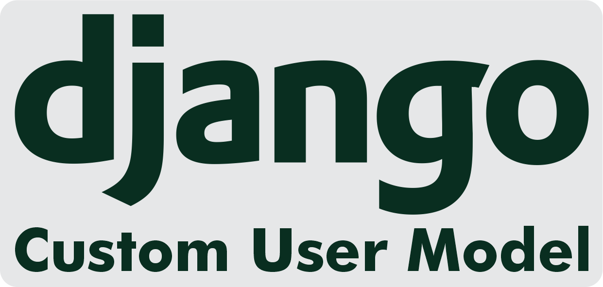

<h1 align="center">
  <a href="https://github.com/WesGtoX/CustomUserModel">
    
  </a>
</h1>

<p align="center">
  <a href="#about-the-project">About</a>&nbsp;&nbsp;|&nbsp;&nbsp;
  <a href="#technology">Technology</a>&nbsp;&nbsp;|&nbsp;&nbsp;
  <a href="#getting-started">Getting Started</a>&nbsp;&nbsp;|&nbsp;&nbsp;
  <a href="#roadmap">Roadmap</a>&nbsp;&nbsp;|&nbsp;&nbsp;
  <a href="#how-to-contribute">Contributing</a>&nbsp;&nbsp;|&nbsp;&nbsp;
  <a href="#license">License</a>
</p>

<p align="center">
  
  
  
  
  
</p>


# Custom User Mode

Fully replace the username field with an email field for Django authentication.


## About the Project

This project is a customization in the Django user model.

Django's authentication by username has been completely replaced by the user's email.


## Technology

This project was developed with the following technologies:

- [Python](https://www.python.org/)
- [Django Framework](https://www.djangoproject.com/)
- [Django REST Framework](https://www.django-rest-framework.org/)
- [Docker](https://www.docker.com/)
- [Docker Compose](https://docs.docker.com/compose/)


## Getting Started

### Prerequisites

- [Python](https://www.python.org/)
- [Docker](https://www.docker.com/)
- [Docker Compose](https://docs.docker.com/compose/)


### Install and Run

1. Clone the repository:
```bash
git clone https://github.com/WesGtoX/CustomUserModel.git
```
2. Set a `SECRET_KEY` in `.env`:
```bash
cp .env.sample .env
```
3. Run:
```bash
make run
```
4. Run tests:
```bash
make test
```


## Roadmap

See the [open issues](https://github.com/WesGtoX/CustomUserModel/issues) for a list of proposed features (and known issues).


## How to contribute

Contributions are what make the open source community such an amazing place to be learn, inspire, and create. Any contributions you make are **greatly appreciated**.

1. Fork the Project.
2. Create your Feature Branch `git checkout -b feat/my-feature`.
3. Commit your Changes `git commit -m 'feat: My new feature'`.
4. Push to the Branch `git push origin feat/my-feature`.
5. Open a Pull Request.

After the merge of your pull request is done, you can delete your branch.


## License

Distributed under the MIT License. See [LICENSE](LICENSE) for more information.

---

Made with ♥ by [Wesley Mendes](https://wesleymendes.com.br/) :wave:
